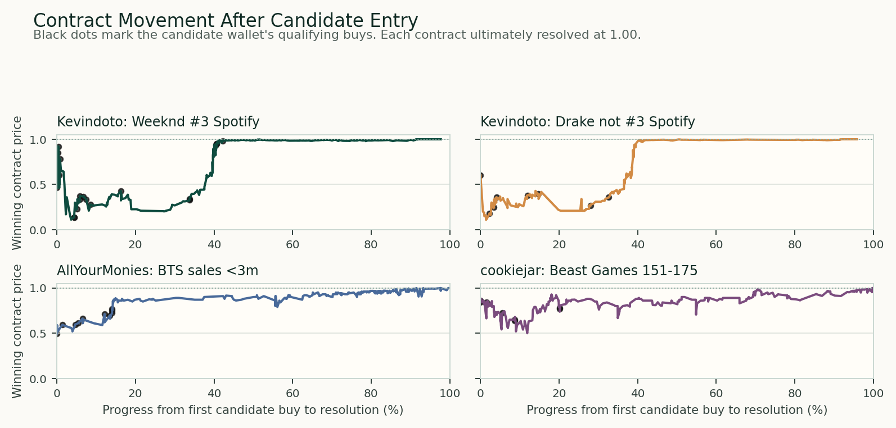

# Potential Informed Trading on Polymarket

**View.** I would submit three potential insider-trading candidates from the
reviewed market set. `Kevindoto` is the best market-structure lead because the
wallet expressed a paired view inside the same Spotify ranking complex: The
Weeknd would finish third and Drake would not. `AllYourMoniesAreBelongToMe` is
the best size-anomaly lead because the BTS album-sales position was roughly
116 times the wallet's prior median trade size. `cookiejar` is the cleanest
production-access lead because it bought a Beast Games result market 38 to 48
days before resolution, when the show result was likely already known inside
the production chain.

The core idea is not "large wallet won a trade." It is that these wallets
entered correct-side positions in markets where a specific group could plausibly
know the answer earlier than the public: streaming platforms, labels,
distributors, chart vendors, or production teams.

## Screen and Heuristics

I reviewed **154 resolved markets across 42 events**, covering **$211.9
million** of market lifetime volume and **205,362 pulled trades from 44,607
wallets**. The pipeline uses two screens (see `heuristics.md`): a stricter
**ranking screen** (20 to 70 cents, $5,000, 48 hours) that scores the whole
wallet universe, and a wider **triage screen** that surfaces candidates for
manual review. The candidate detail below comes from the triage screen, which
keeps clusters where the wallet bought the ultimately winning contract at
**20 to 85 cents**, at least **24 hours before resolution**, with at least
**$3,000** of notional buying in that market.

| Heuristic | Why it matters | Candidate hit |
|---|---|---|
| Specific information owner | Insider theories are stronger when the market maps to a real access point. | Spotify ranking data, album-sales tracking, production-result knowledge. |
| Non-obvious entry price | Buys at 40 to 80 cents still have downside; this excludes near-certain 99-cent cleanup. | All four selected wallet-market rows entered below 80 cents on average except cookiejar at 78.2 cents. |
| Clustered or paired conviction | Repeated buying, or a linked long/short view in the same event, is stronger than one lucky fill. | Kevindoto bought both The Weeknd YES and Drake NO in the same Spotify rank complex. |
| Wallet-relative abnormality | A smaller dollar trade can still be important when it is large for that wallet. | AllYourMonies' BTS position was about 116 times prior median trade size. |
| Contract movement after entry | A real lead should survive later price volatility and resolve in the predicted direction. | Each selected contract later traded to 99.9 cents before resolving at 1.00. |

## Candidate Detail

| Priority | Wallet | Position | Why it looks insider-shaped |
|---:|---|---|---|
| 1 | `Kevindoto` `0xcd71fd...0d127` | Bought **$10,520** of The Weeknd YES at **45.3 cents** average and **$5,549** of Drake NO at **40.9 cents** average. | The paired trade is the signal: one wallet expressed both sides of the third-place Spotify ranking question. A plausible source would be platform analytics, label dashboards, distributor data, or unpublished year-end ranking snapshots. |
| 2 | `AllYourMoniesAreBelongToMe` `0x856484...84b2e` | Bought **$5,747** of BTS "Arirang" debut-week sales below 3 million at **71.6 cents** average, **42 to 49 days** before resolution. | Album-sales thresholds are natural information-asymmetry markets. Labels, distributors, chart-reporting vendors, and sales-operations teams can see preorder or tracking signals before the public. |
| 3 | `cookiejar` `0x614ef9...4f1b` | Bought **$5,806** of the Beast Games contestant-number 151-175 YES contract at **78.2 cents** average, **38 to 48 days** before resolution. | This is the cleanest role-conflict story. If the season was filmed and edited, someone in production, casting, post-production, or the contestant network could know the result long before the public market resolved. |

## Contract Movement and Resolution

The free Polymarket trade API shows that these were not simple endgame sweeps.
The contracts still moved against the candidate wallets after entry, then
confirmed into resolution.

| Wallet / market | Entry average | Worst price after first buy | Worst price after last buy | Last pre-resolution trade | Resolution |
|---|---:|---:|---:|---:|---|
| Kevindoto / Weeknd third on Spotify | 0.453 | 0.112 | 0.339 | 0.999 | YES won |
| Kevindoto / Drake third on Spotify | 0.409 | 0.110 | 0.357 | 0.999 | NO won |
| AllYourMonies / BTS sales below 3m | 0.716 | 0.497 | 0.750 | 0.999 | YES won |
| cookiejar / Beast Games 151-175 | 0.782 | 0.500 | 0.667 | 0.999 | YES won |

## Interpretation

The notional floors used here ($5,000 for ranking, $3,000 for triage) are not
too low for this kind of work. A pure whale threshold would miss stealthier
insider behavior, and Polymarket wallets can be meaningful even when the
notional looks modest in institutional terms.
For this assignment, the better signal is a bundle: correct side, non-obvious
price, specific information owner, abnormal wallet behavior, and favorable
contract movement after entry.

Timing also depends on the market. A production-result trade can be suspicious
weeks before resolution because the result may already be fixed internally. A
streaming-rank trade may cluster closer to resolution because the informational
edge comes from late internal dashboards or ranking snapshots. These three
wallets fit those different timing patterns.

Artifacts: <code>data/candidate_wallet_leads.csv</code>,
<code>data/candidate_market_movements.csv</code>,
<code>data/candidate_market_price_points.csv</code>, and
<code>report/candidate_market_movements.png</code>. The candidate list is a
triage queue for tracing and attribution, not a legal conclusion. Some wallet
history fields are capped by public endpoints; the contract-movement checks
come from market-level trade API data.

