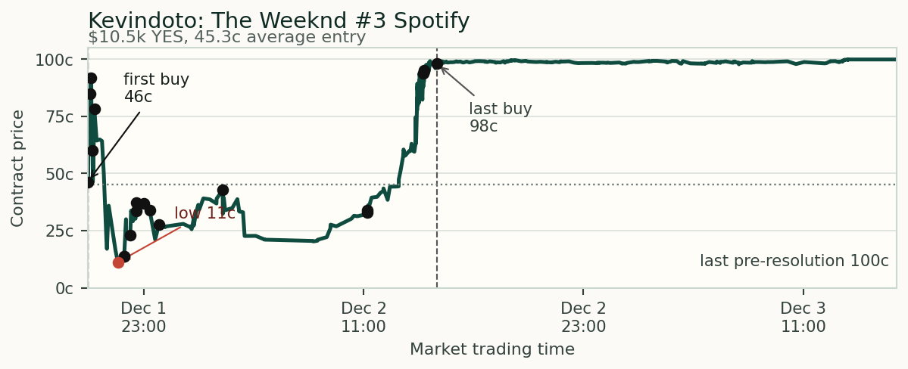
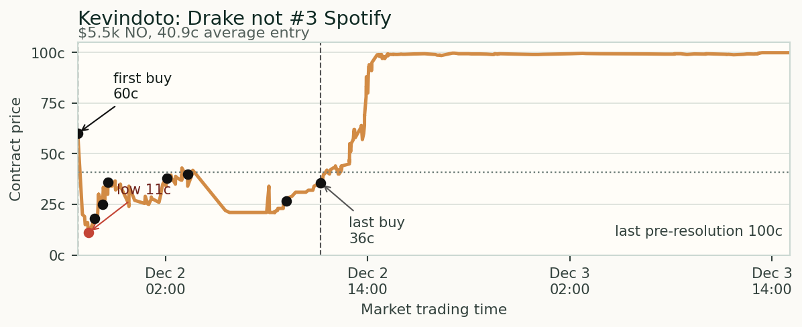
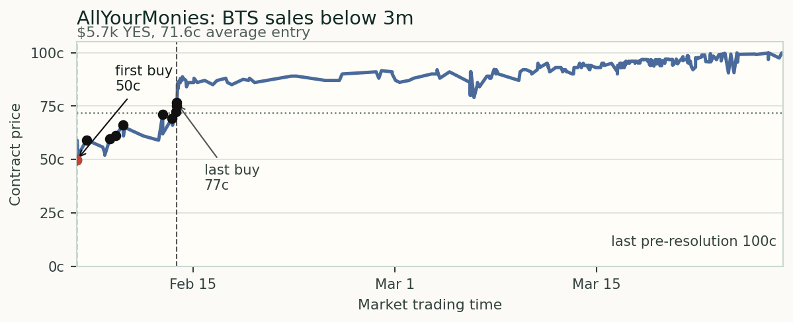
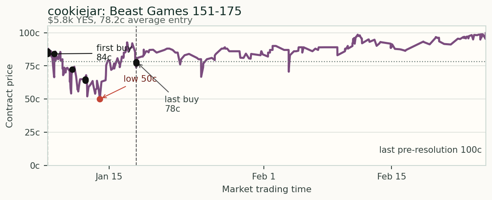

# Potential Informed Trading on Polymarket

**Executive view.** I would submit three wallets for follow-up. `Kevindoto` is
the strongest market-structure case: one wallet bought both sides of the same
Spotify ranking thesis, The Weeknd to finish third and Drake not to finish
third. `AllYourMoniesAreBelongToMe` is the clearest size anomaly: the BTS
sales bet was roughly 116 times the wallet's prior median trade. `cookiejar` is
the cleanest production-access case: it bought a Beast Games outcome weeks
before resolution, when the result may already have been known inside the
production chain.

The point is not that these wallets simply won. The stronger
pattern is correct-side buying in markets where a specific group could
plausibly know the answer earlier than the public.

## Screen and Heuristics

The review covered **154 resolved markets**, **$211.9 million** of market
lifetime volume, and **205,362 pulled trades**. I used a strict ranking screen
for the full wallet universe, then a wider triage screen to find candidate rows
for manual review.

| Heuristic | What it tests | How it showed up |
|---|---|---|
| Information access point | Market outcome depends on data a small group may see early. | Spotify ranks, album sales, production results. |
| Price still had downside | Entries were not 99-cent cleanup trades. | Selected positions averaged 40.9c to 78.2c. |
| Wallet behavior stood out | Trade pattern was unusual for the wallet or market complex. | Paired Spotify view, 116x prior median size, early production-result bet. |

## Candidate Detail

| Wallet | Market | Position | Insider-style read |
|---|---|---|---|
| `Kevindoto` `0xcd71fd...0d127` | Spotify third-place artist: Weeknd YES / Drake NO | $16.1k total at 43.8c weighted average | Paired ranking view pointing to platform, label, or distributor data. |
| `AllYourMoniesAreBelongToMe` `0x856484...84b2e` | BTS "Arirang" debut-week sales below 3m | $5.7k YES at 71.6c average | Sales-threshold bet far above the wallet's normal trade size. |
| `cookiejar` `0x614ef9...4f1b` | Beast Games contestant 151-175 wins | $5.8k YES at 78.2c average | Production-result market where the answer may have been known before airing. |

## Entry Timing and Contract Movement

The charts mark each wallet's entry window. In all four markets, the contract
later moved against the wallet before closing near 1.00 on the side they
bought.

| Market | Entry avg. | Worst after entry | Last pre-resolution | Won side |
|---|---:|---:|---:|---|
| Weeknd #3 | 45.3c | 11.2c | 99.9c | YES |
| Drake not #3 | 40.9c | 11.0c | 99.9c | NO |
| BTS sales <3m | 71.6c | 49.7c | 99.9c | YES |
| Beast Games 151-175 | 78.2c | 50.0c | 99.9c | YES |

## Interpretation

The **$3,000 to $5,000** notional range is not too low for this assignment. A
pure whale filter would miss quieter insider-style behavior. The more useful
signal is the bundle: knowable-by-few market, non-obvious price, unusual wallet
behavior, and price action that later confirms the position.

Timing depends on the market. A production-result trade can be suspicious weeks
before resolution. A streaming-rank trade can cluster closer to resolution if
the edge comes from late platform or label data.

## Submission Methodology Appendix

This appendix maps the memo to the four requested tasks so the document can
stand on its own without sharing the full GitHub repository.

| Assignment task | What I did | Result |
|---|---|---|
| Data collection | Public Polymarket markets, trades, wallet stats, and refreshed trade API data for selected contracts. | 154 markets, 205,362 trades, 44,607 wallets. |
| Heuristic design | Explainable screen: access point, non-obvious price, wallet behavior, wash/noise filter, contract movement. | No black-box score in the memo. |
| Application to traders | Screened wallet-market clusters, then manually reviewed the strongest rows. | Three wallets, four positions. |
| Ranking and methodology | Priority is qualitative and auditable: paired Spotify view, size anomaly, production-access logic. | Support files available on request. |

If supporting files are requested, send the small artifact package rather than
the full working repository.
